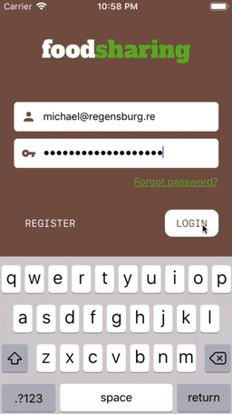
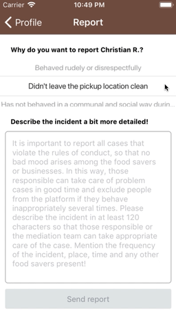
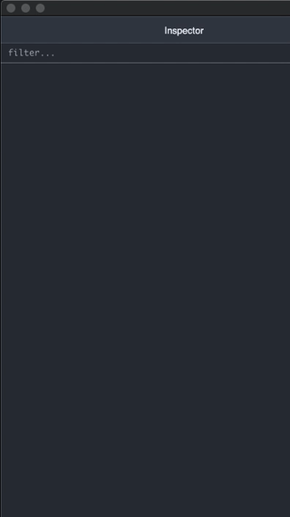

# 🍴foodsharing app &middot;  [](https://travis-ci.org/rastapasta/foodsharing)

    

This is a full Proof of Concept to show how [React Native](https://github.com/facebook/react-native) could rock the [foodsharing](https://foodsharing.network) world.

The app is optimized for iOS and Android - one code, one love!

Timeframe: 2 weeks from scratch to production 😎

## 🎁 Try it out!

* iOS
  * Install [TestFlight](https://apps.apple.com/de/app/testflight/id899247664)
  * Tap on [this invitation link](https://testflight.apple.com/join/WL977HAG)

* Android
  * [Choose a minimized version](https://intern.regensburg.re/foodsharing/) for your platform
  * or just install [the universal APK](https://intern.regensburg.re/foodsharing/app-release.apk)

## 🎉 What's implemented?

* Login
  * Full login / reauthentication / logout flows from cold and warm start
  * Restores session if previously logged in - even if device offline
  * Using device's keychain to store credentials in a secure location
  * Auth form for email and password
  * Buttons -> navigate to web based register & password restore
  * Loading indication inside login button
  * Notification of failed login
  * Display of the current build version

* Drawer
  * Display of logo and name of user
  * Button -> navigation to own profile
  * Button -> send lovely feedback during beta
  * Button -> Logout
  * Display of the current build version

* Conversations
  * Send and receive messages
  * Highlight/unhighlight of unread messages (sending 'read' signal to backend)
  * Unlimitted scroll and pagination for conversation messages
  * Activity indicator for all interactions
  * Conversation overview limited to the 50 latest conversations for now - because.. so much to do.. :)
  * Connect to and handle WebSocket chat interface
  * Local Notifications while app runs in the background
  * Touch on Notification directly brings you to corresponding conversation (iOS only for now)
  * Background conversations list pull every 15 minutes (iOS only for now)
  * Display number of unread conversations as icon badge on home screen (iOS and some Android)
  * Persist message drafts (per conversation)
  * Shorten very long messages and display a 'read more' button
  * Group chats (incl. multiple avatars displayed)
  * Named chats (= title changed via web UI)
  * Disable sending button while sending
  * Tap on group conversation title -> navigate to list of members
  * Tap on personal conversation title -> navigate to profile page
  * Today -> Yesterday -> $Date labeling in conversation list
  * Today -> Yesterday -> $Date seperators in conversation
  * Detect URLs to foodsharing* in messages and make them clickable
  * Pull to refresh

* Group Conversation members
  * Photo and name of group members
  * Tap on list item -> navigate to profile of foodsaver

* Profile
  * Screen scrape (until rest interface exists) of stats/information
  * Image of foodsaver, paralax style
  * Loading indicator
  * Statistic circles
  * Banana support! Button -> jump to Bananas scene
  * Friendship button - signals friendship-offered status
  * Send friendship request by touching friendship button (incl. loading indicator)
  * Message button -> initiate conversation and jump to Conversation scene (incl. loading indicator)
  * Report button -> jump to Report scene -> jump back (incl. loading indicator)
  * Information segments parsed from the profile page

* Bananas
  * List of all received bananas and corresponding banana texts

* Violation Report
  * Wait, what? There's an API for it? Yep, at least to [send them in](https://gitlab.com/foodsharing-dev/foodsharing/blob/master/src/Modules/Report/ReportXhr.php#L189-209) :)
  * Fully translated German <> English reporting system
  * Picker(s) for report reason(s)
  * Dynamic checkbox displaying of nested options
  * Text entry for report text, autoscaling to fullscreen on text focus
  * Hooking into Android's back button & blur event to leave fullscreen
  * Sending/Success indicator on Profile scene

* Baskets
  * List of your own and nearby baskets
  * Scene to view basket with creator, info, map
  * Buttons to either message user or directly call phone
  * Buttons to either edit or delete as the creator of the basket
  * Image of basket
  * Create Basket scene
  * Dynamic form to enter details, time frame and desired way of contact
  * Camera button -> Camera scene to take picture
  * Display of taken picture (currently *not* uploaded)
  * Mini map with marker at currently choosen location
  * Tap on mini map -> Location picker scene with current location preselected
  * Possibility to set marker on current location

* Camera
  * Permission management - prompting on first use
  * If permission denied, info and button leading to system settings
  * If permission granted, take picture button
  * Automatic rescale to backends 'normal' 800x before upload

* Map
  * Embedded map based on system (iOS: Apple Maps, Android: Google Maps)
  * Clustering of markers
  * Showing fairteiler and baskets
  * Tracking/centering of the user's current location on demand
  * Button to zoom back to initial region
  * Prompt for location permission on demand
  * Reusing marker icons from Android version

* Fairteiler
  * Adress, picture and information
  * Posts made to the Fairteilers wall (incl. images)
  * Share button to copy or forward public Fairteiler URL
  * Swipeable layout, number of comments in tab
  * Navigate to profile on foodsaver image touch

* Persisted central data ([redux](https://redux.js.org/)) store
  * Persistence of conversations, messages, foodsavers, ...
  * Full reset on logout
  * Full offline read-only capability
  * Caching of downloaded images via native libraries

* UI / UX
  * Custom fonts / 'foodsharing identity'
  * All strings mapped to [i18n files](https://github.com/rastapasta/foodsharing/tree/master/assets/translations)

* Deployment, testing and CI
  * [Detox](https://github.com/wix/Detox) & [Mocha](https://github.com/mochajs/mocha) E2E UI test framework
    * Over 60 test cases incl. auth, messaging, baskets, map, fairteiler, ...
  * Travis CI
    * Linting and test compilation of TypeScript
    * Native compile and E2E simulator tests
  * Fastlane iOS
    * app icon generation
    * app icon badge generation (version & build number)
    * certificate handling
    * testflight/appstore deployment

* Tech stack
  * React Native
  * redux / [redux-saga](https://github.com/rastapasta/foodsharing/tree/master/src/sagas) for js generator magic :heart:
  * see [package.json](https://github.com/rastapasta/foodsharing/blob/master/package.json) for complete package list

## 👩‍💻👨‍💻‍ Run / Compile it locally

Setup your React Native environment by following the [Getting started guide](https://facebook.github.io/react-native/docs/getting-started) (React Native CLI Quickstart).

After cloning the project, initialize its node environment, compile the TypeScript and finally the native version:
```bash
$> yarn
$> tsc

# then for iOS
$> cd ios
$> pod install
$> cd ..
$> react-native run-ios

# or for Android - make sure to have your emulator running or phone connected in developer mode
$> react-native run-android
```

To get an insight into the redux action flow, state and log, use [react-native-debugger
](https://github.com/jhen0409/react-native-debugger) and the ```Debug``` mode via React Native's shaking menu.

To let it use your local [docker development environment](https://devdocs.foodsharing.network/getting-the-code.html) instead of production endpoints, set ```PRODUCTION``` to ```false``` in the [configuration file](https://github.com/rastapasta/foodsharing/blob/master/src/common/config.tsx#L1).

## 👨‍💻‍👩‍💻 Run the E2E tests

Setup your detox environment by following the [Step 1](https://github.com/wix/Detox/blob/master/docs/Introduction.GettingStarted.md#step-1-install-dependencies) of detox's documentation.

Afterwards, first compile the test version (only needed once per native breaking change) and start the tests afterwards:

```bash
$> detox build --configuration ios.sim.debug
$> detox test --configuration ios.sim.debug
```

## 🤔 Personal ToDos

* Should have
  * Optimize and benchmark rendering
  * Android
    * Camera, when first blocking permissions, going to settings, granting them, return -> overlay stays visible
    * Map markers on location selector scene is lagging behind movement
  * Reflect REQUEST_ERROR errors in the seperate UIs instead of silently canceling the loading/sending
  * Pull conversation again when open and coming from background to make sure its marked as read
  * Notifications after background pull / detect new conversations - even pull pull conversations? Delta algo!
  * Handle WebSocket reconnect after long inactivity

* Nice to have
  * Make sure there is no gap between old store and long-time-no-see message list request -> hotfix: logout-in
  * Deep linking via apple-app-site-association, needs to be merged to fs master & production
  * Settings screen to setup background pull / notifications?
  * Use ```CONVERSATIONS_SUCCESS``` to warm up conversation's message (at least one)
  * State for loading conversations overview for loading indicator

* Feature creep
  * Edit profile information / Mütze :)

## 😢 Why some few German in between the UI? (example: foodsaver profile scene)

While the app and its screens are fully [i18n translated](https://github.com/rastapasta/foodsharing/blob/master/assets/translations/en.json), a few [foorsharing endpoints](https://gitlab.com/foodsharing-dev/foodsharing/tree/master/src/Controller) deserve some love by someone motivated. Information like the profile details are returned by the backend in German only - fix it, and i will adapt it!